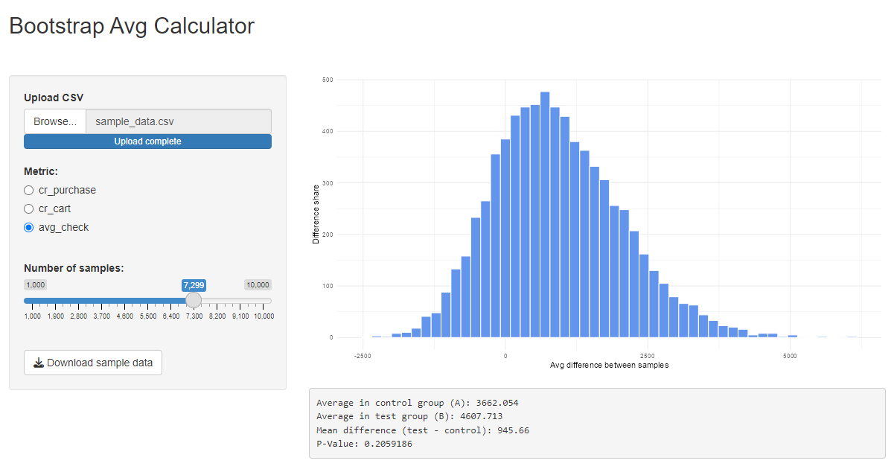

# Bootstrap average calculator (Shiny app)

Bootstrap is a statistical method used to estimate the properties of parameters and distributions. It is often applied to assess standard errors and confidence intervals for various statistics (mean, median, proportion, etc.).

The method is based on the idea of reusing existing data to generate a large number of pseudo-samples:

1. A large number of new samples of a given size are created from the original sample. Each sample is formed by randomly drawing elements from the original sample with replacement.
2. For each pseudo-sample, the statistic of interest (e.g., mean value or variance) is calculated. This produces a distribution of statistics, which we then use as needed.

---
To get started, you need to meet 3 requirements for the file:
1. All metrics <strong>must be</strong> numeric format;
2. Other fields (such as <code>date</code>, <code>var</code>) <strong>should not</strong> be numeric;
3. The variant field must be <strong>strictly</strong> named <code>var</code>. The options are <strong>strictly</strong> <code>a</code> and <code>b</code>.

You can download a demo dataset to see how to prepare the file :)

